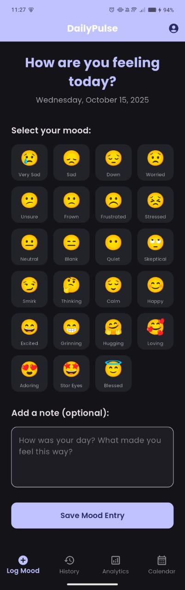

# DailyPulse - Personal Wellness Tracker

A beautiful Flutter mobile application that helps users track their daily emotional state, view mood history, and gain insights into their emotional patterns. Built with Firebase integration for authentication and cloud storage, plus local persistence for offline functionality.

## 🌟 Features

### Core Features (Must-Have)
- **Mood Logging Interface**: Select from 24 different emoji moods with optional notes
- **Mood History**: View all past entries with date, time, and notes in a clean list
- **Basic Analytics**: Track positive vs negative days with visual charts
- **Data Persistence**: Both local storage (SharedPreferences) and cloud storage (Firestore)
- **Clean UI/UX**: Modern Material Design 3 with consistent styling and responsive layout

### Bonus Features
- **Firebase Authentication**: Secure email/password login and signup
- **Cloud Firestore Integration**: Real-time sync across devices
- **Calendar View**: Visual calendar showing mood entries by date
- **Dark Mode Support**: Automatic theme switching
- **Advanced Analytics**: Pie charts and trend analysis
- **Real-time Updates**: Live data synchronization

## 🎨 Design Philosophy

DailyPulse is designed with mental health awareness in mind. The app features:
- **Calming Color Palette**: Soft purple-blue primary color (#6B73FF)
- **Intuitive Emoji System**: 24 carefully selected emojis representing the full emotional spectrum
- **Thoughtful Typography**: Google Fonts Poppins for clean, readable text
- **Accessible Design**: High contrast ratios and clear visual hierarchy
- **Emotional Intelligence**: Positive/negative/neutral mood categorization

## 🏗️ Technical Architecture

### State Management
- **setState**: Used for local UI state management as required
- **StreamBuilder**: For real-time Firebase data synchronization
- **Provider**: Available for complex state management (optional)

### Data Layer
- **Models**: `MoodEntry` and `User` with proper serialization
- **Local Storage**: SharedPreferences for offline functionality
- **Cloud Storage**: Cloud Firestore for cross-device sync
- **Services**: Separate service classes for Firebase and local storage operations

### UI Components
- **Material Design 3**: Modern, consistent design system
- **Custom Themes**: Light and dark mode support
- **Responsive Layout**: Works on various screen sizes
- **Navigation**: Bottom navigation with smooth transitions

## 📱 Screenshots

### Authentication Screens

*Clean login interface with email/password authentication*


*User registration with form validation*

### Mood Tracking Features

*Intuitive emoji selection with 24 mood options and note input*


*Chronological list of all mood entries with dates and notes*


*Visual analytics with pie charts and mood insights*


*Calendar integration showing mood entries by date*


## 🚀 Getting Started

### Prerequisites
- Flutter SDK (3.x or higher)
- Dart SDK (3.9.2 or higher)
- Firebase project setup
- Android Studio / VS Code with Flutter extensions

### Installation

1. **Clone the repository**
   ```bash
   git clone https://github.com/yourusername/dailypulse.git
   cd dailypulse
   ```

2. **Install dependencies**
   ```bash
   flutter pub get
   ```

3. **Firebase Setup**
   - Create a new Firebase project at [Firebase Console](https://console.firebase.google.com/)
   - Enable Authentication (Email/Password)
   - Enable Cloud Firestore
   - Download `google-services.json` (Android) and `GoogleService-Info.plist` (iOS)
   - Place them in the appropriate directories:
     - Android: `android/app/google-services.json`
     - iOS: `ios/Runner/GoogleService-Info.plist`

4. **Run the application**
   ```bash
   flutter run
   ```

### Firebase Configuration

The app requires the following Firebase services:
- **Authentication**: Email/password authentication
- **Cloud Firestore**: For storing mood entries and user data

Make sure to enable these services in your Firebase console and configure the security rules appropriately.

## 📊 Data Structure

### MoodEntry Model
```dart
{
  'id': 'unique_identifier',
  'emoji': '😊',
  'note': 'Had a great day!',
  'date': timestamp,
  'userId': 'user_uid'
}
```

### User Model
```dart
{
  'uid': 'firebase_user_id',
  'email': 'user@example.com',
  'displayName': 'User Name'
}
```

## 🎯 Emotion Logic

The app categorizes emotions into three main groups:

### Positive Emotions (Green)
- 😊 Happy, 😄 Excited, 😁 Grinning, 🤗 Hugging
- 🥰 Loving, 😍 Adoring, 🤩 Star Eyes, 😇 Blessed

### Neutral Emotions (Orange)
- 😐 Neutral, 😑 Blank, 😶 Quiet, 🙄 Skeptical
- 😏 Smirk, 🤔 Thinking, 😌 Calm

### Negative Emotions (Red)
- 😢 Very Sad, 😞 Sad, 😔 Down, 😟 Worried
- 😕 Unsure, 🙁 Frown, ☹️ Frustrated, 😣 Stressed

## 🧪 Testing

Run the test suite:
```bash
flutter test
```

## 📦 Build

### Android APK
```bash
flutter build apk --release
```

### iOS
```bash
flutter build ios --release
```

## 🔧 Development

### Project Structure
```
lib/
├── main.dart                 # App entry point
├── models/                   # Data models
│   ├── mood_entry.dart
│   └── user.dart
├── services/                 # Business logic
│   ├── firebase_service.dart
│   └── local_storage_service.dart
├── screens/                  # UI screens
│   ├── auth/
│   │   ├── login_screen.dart
│   │   └── signup_screen.dart
│   ├── home/
│   │   └── home_screen.dart
│   └── mood/
│       ├── add_mood_screen.dart
│       ├── mood_history_screen.dart
│       ├── mood_analytics_screen.dart
│       └── calendar_screen.dart
└── widgets/                  # Reusable components
```

## 🤝 Contributing

1. Fork the repository
2. Create a feature branch (`git checkout -b feature/amazing-feature`)
3. Commit your changes (`git commit -m 'Add amazing feature'`)
4. Push to the branch (`git push origin feature/amazing-feature`)
5. Open a Pull Request

## 📄 License

This project is licensed under the MIT License - see the [LICENSE](LICENSE) file for details.

## 🙏 Acknowledgments

- Flutter team for the amazing framework
- Firebase for backend services
- Google Fonts for beautiful typography
- The open-source community for inspiration

## 📞 Support

For support, email support@dailypulse.com or create an issue in this repository.

---

**DailyPulse** - Track your emotions, understand yourself better. 💜